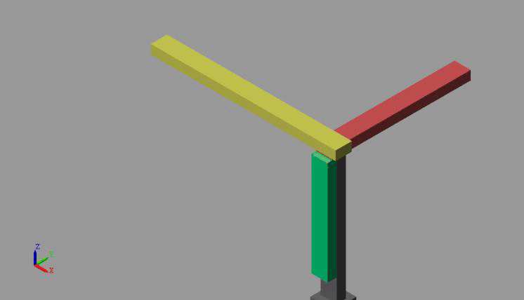
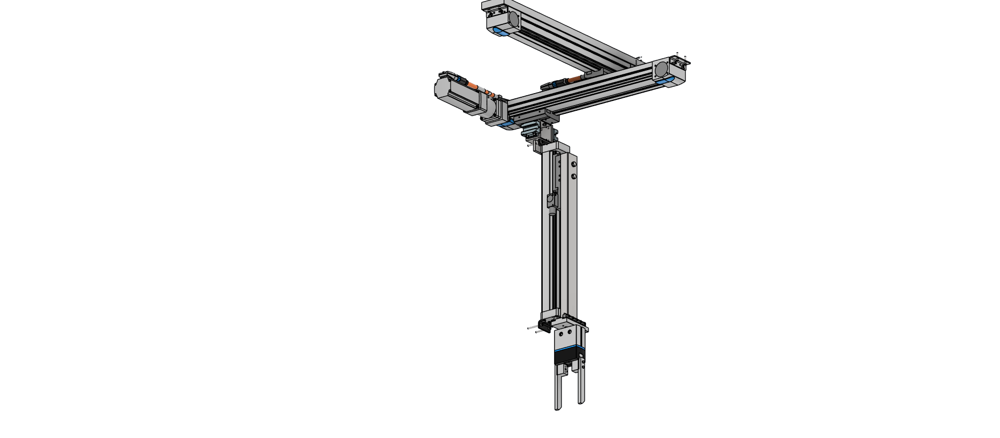
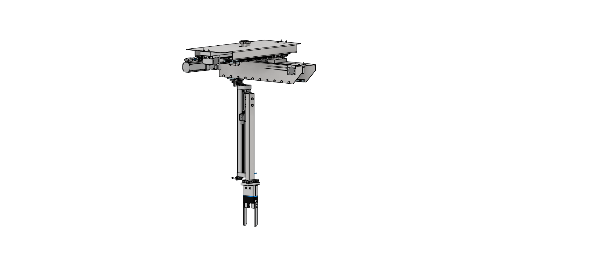
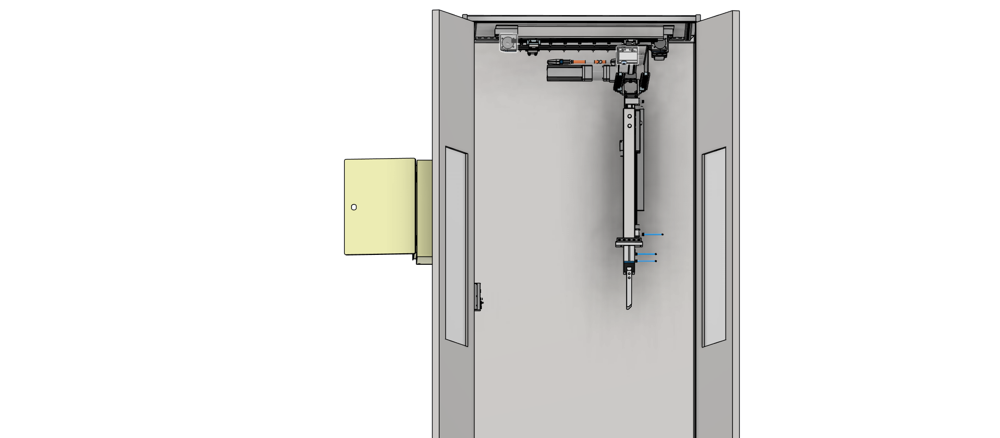
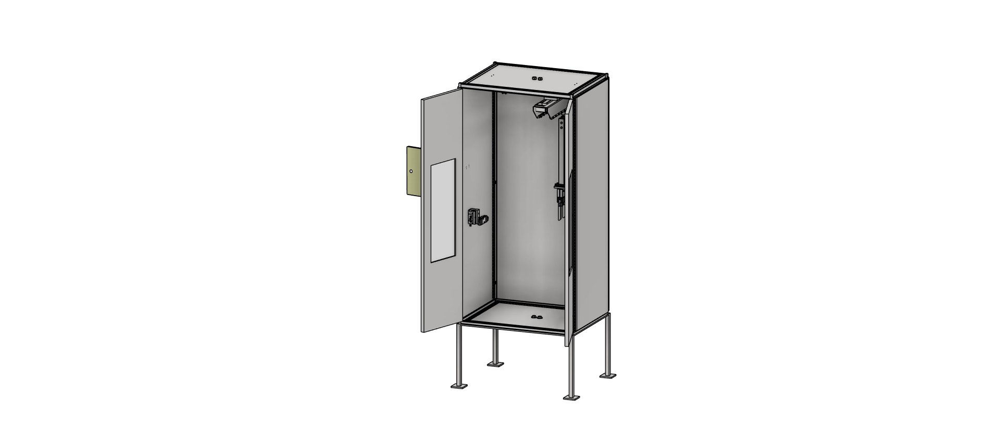
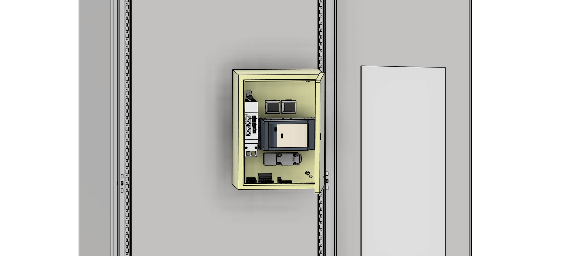
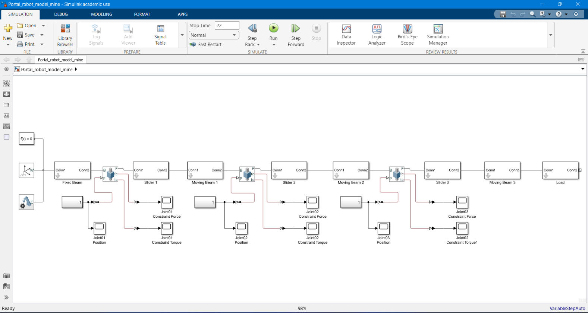

# Cartesian Robotic Manipulator 🚀

---

## 📌 Overview
This repository presents one of my MSc project at the **University of Debrecen**:  
the design and dynamic analysis of a **3-DOF Cartesian robotic manipulator** for payload transfer.

📄 [Full Project Report (PDF)](Docs/CartesianManipulator_Report.pdf)

  

---

## 📖 Project Overview
- **Objective:** Transfer a 7–9 kg payload along a defined trajectory (X=350 mm, Y=350 mm, Z=250 mm) within a 22 s cycle time.
- **Tools Used:** 
  - Autodesk Inventor → 3D CAD design and assembly
  - MATLAB Simulink → Motion dynamics and control simulation
  - FESTO Positioning Drives → Actuator and motor selection
- **Key Features:**
  - 3 prismatic joints (X, Y, Z axes)
  - Belt-driven linear actuators with Festo servo motors
  - Integrated gripper for payload handling
  - Kinematic and dynamic analysis (displacement, velocity, acceleration)

## ⚙️ Kinematics & Dynamics
- Degrees of Freedom: **3 DoF**
- Denavit–Hartenberg parameters defined for prismatic joints
- Simulink simulations for:
  - Displacement vs. time
  - Velocity vs. time
  - Acceleration vs. time

## 📊 Simulation Results
- Verified cycle time: 22 s
- Maximum speed: ~1.25 m/s
- Acceleration: up to 13.3 m/s²
- Payload stability ensured with optimized actuator sizing

## 🖼️ Gallery
### CAD View

---
### Simulation

## 📂 Repository Contents
- `CAD/` → Inventor and STEP model
- `Simulation/` → MATLAB Simulink model
- `Docs/` → Full MSc project report (PDF)
- `Images/` → Renders 

## 📌 Learning Outcomes
- Mastery of CAD-to-simulation workflow
- Integration of mechanical design with control system modeling
- Actuator selection based on simulation-driven requirements
- Application of robotics theory to industrial automation

---

### 🔖 Citation
If you use this work, please cite:
> Mohammad Alghazawi, *Cartesian Robotic Manipulator*, MSc Projects, University of Debrecen, 2023.

---

### 📜 License
This project is released under the MIT License. Feel free to use and adapt with attribution.

